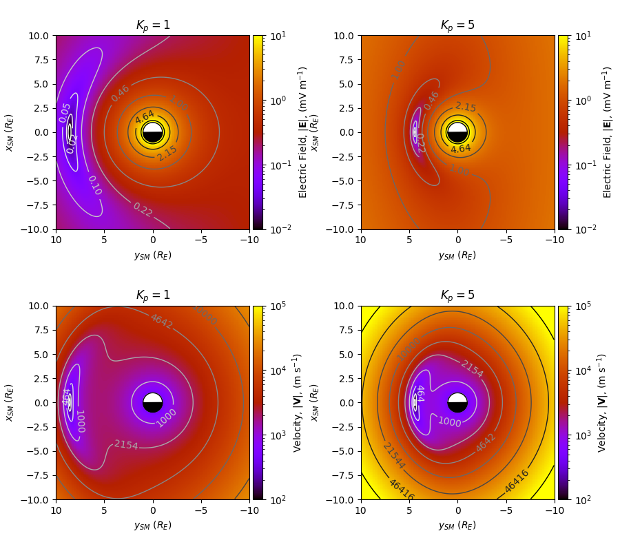

# vsmodel
A simple implementation of the Volland-Stern electric field model (Volland, 1973; Stern, 1975).

The electric field model here is only defined in the equatorial plane around the Earth, where any vertical component returns is filled with zeros.

The implementation of this model is based on that used by Zhao et al. 2017.

## Installation

Install using this Github repo:

```bash
git clone https://github.com/mattkjames7/vsmodel
cd vsmodel
```

then either using `setup.py`:

```bash
python3 setup.py install --user
```

or by creating a wheel:

```bash
python3 setup.py bdist_wheel
pip3 install dist/vsmodel-x.x.x-py3-none-any.whl --user
```

where `x.x.x` should be replaced with the current version number.


Alternatively, install using `pip3`:

```bash
pip3 install vsmodel --user
```


## Usage

There are two functions which can be used to calculate the model electric field, one using polar coordinates and the other using the Cartesian Solar Magnetic (SM) coordinate system:

```python
import vsmodel

#the Cartesian model
Ex,Ey,Ez = vsmodel.ModelCart(x,y,Kp)

#the polar model
Er,Et,Ep = vsmodel.ModelPol(r,phi,Kp)
```

where `Kp` is the *K<sub>p</sub>* index; `x` and `y`  are the Cartesian coordinates in the magnetic equatorial plane (in R<sub>E</sub>, where R<sub>E</sub>=6378 km); `r` and `phi` are the equatorial radial distance from the centre of the Earth (in *R<sub>E</sub>*) and the azimuthal angle (`phi`=0.0 at noon, in radians). Both functions return the electric field in units of mV/m

### Plotting the model

The function `vsmodel.PlotModelEq` will plot the V-S model potential, electric field, a dipole magnetic field and the **E**x**B** velocity in the equatorial plane, e.g.:

```python
import vsmodel
import matplotlib.pyplot as plt
plt.figure(figsize=(9,8))
ax0 = vsmodel.PlotModelEq('E',Kp=1.0,maps=[2,2,0,0],fig=plt,fmt='%4.2f',scale=[0.01,10.0])
ax1 = vsmodel.PlotModelEq('E',Kp=5.0,maps=[2,2,1,0],fig=plt,fmt='%4.2f',scale=[0.01,10.0])
ax2 = vsmodel.PlotModelEq('V',Kp=1.0,maps=[2,2,0,1],fig=plt,scale=[100.0,100000.0])
ax3 = vsmodel.PlotModelEq('V',Kp=5.0,maps=[2,2,1,1],fig=plt,scale=[100.0,100000.0])
ax0.set_title('$K_p=1$')
ax2.set_title('$K_p=1$')
ax3.set_title('$K_p=5$')
ax1.set_title('$K_p=5$')
plt.tight_layout()
```

Which should produce this:




### Notes on the coordinate systems

#### SM

The Solar Magnetic (SM) coordinate system is defined such that the *z*-axis is aligned with the Earth's magnetic dipole; the *x*-axis lies in the plane which contains both the Earth-Sun line and the dipole axis (the *x*-axis points close-ish towards the Sun); the *y*-axis completes the right-handed set and points approximately in the opposite direction to that of the Earth's orbital motion around the Sun.

As this model is defined only in the equatorial plane, there is no input for the *z* coordinate; also there is not a *z* component to the model so `Ez` is filled with zeros.

#### Polar

The polar coordinates used are defined such that `r` is the radial distance from the centre of the planet, `theta` is the polar angle (angle from the positive *z*-axis) and `phi` is the azimuthal angle. `theta` is not used as an input, it is assumed that `theta=`&pi; in the model. The outputs `Er`, `Et` and `Ep` correspond to the radial, polar and azimuthal components of the model electric field. As with the Cartesian version of the model, there is no vertical component to the electric field model, so the `Et` component is filled with zeros.

## Derivation

The derivation of the model equations can be found [here](doc/vsmodel.pdf) - if there any mistakes, please file a bug report, thanks!


## References

Maynard, N. C., and Chen, A. J. (1975), Isolated cold plasma regions: Observations and their relation to possible production mechanisms, *J. Geophys. Res.*, 80( 7), 1009– 1013, doi:[10.1029/JA080i007p01009](https://doi.org/10.1029/JA080i007p01009).

Stern, D. P. (1975), The motion of a proton in the equatorial magnetosphere, *J. Geophys. Res.*, 80( 4), 595– 599, doi:[10.1029/JA080i004p00595](https://doi.org/10.1029/JA080i004p00595).

Volland, H. (1973), A semiempirical model of large‐scale magnetospheric electric fields, *J. Geophys. Res.*, 78( 1), 171– 180, doi:[10.1029/JA078i001p00171](https://doi.org/10.1029/JA078i001p00171).

Zhao, H., Baker, D. N., Califf, S., Li, X., Jaynes, A. N., Leonard, T., … Spence, H. E. (2017). Van Allen probes measurements of energetic particle deep penetration into the low L region (*L* < 4) during the storm on 8 April 2016. *Journal of Geophysical Research: Space Physics*, 122, 12,140– 12,152. https://doi.org/10.1002/2017JA024558